# E-Commerce Customer Behavior & Sales Analytics

An end-to-end data analytics project focused on understanding **e-commerce sales performance, customer behavior, product/category performance, pricing and discounts, delivery experience, geography, and customer engagement**.

The project was completed as a practical **SQL + data analysis + dashboarding** exercise. The dataset was cleaned and validated in MySQL, analyzed through a set of business-driven SQL questions, and visualized in Tableau.

---

## Project Objective

The objective of this project is to move beyond basic SQL practice and investigate how an e-commerce business is performing from several business perspectives:

- Overall sales and order performance
- Monthly growth and MoM trends
- Customer value and purchasing frequency
- Product/category performance
- Discount intensity and pricing behavior
- Delivery performance and customer ratings
- Geographic performance
- Customer engagement and session behavior

The analysis is designed around **business questions first**, with SQL used as the analytical tool to answer them.

---

## Dataset Overview

This comprehensive dataset contains **17,049** e-commerce transactions from a Turkish online retail platform, spanning from **January 2023 to March 2024**. The dataset provides detailed insights into customer demographics, purchasing behavior, product preferences, and engagement metrics.


| Metric | Value |
|---|---:|
| Rows / Orders | 17,049 |
| Unique Customers | 5,000 |
| Columns | 18 |
| Total Quantity Sold | 51,341 |
| Total Sales | 21,779,052.59 |
| Average Order Value | 1,277.44 |
| Product Categories | 8 |
| Cities | 10 |
| Date Range | 2023-01-01 to 2024-03-25 |

### Dataset Fields

The cleaned analysis table contains 18 fields covering order information, customer attributes, product/category details, pricing, payment/device behavior, engagement, delivery, and customer ratings.

Fields include: `Order_ID`, `Customer_ID`, `Date`, `Age`, `Gender`, `City`, `Product_Category`, `Unit_Price`, `Quantity`, `Discount_Amount`, `Total_Amount`, `Payment_Method`, `Device_Type`, `Session_Duration_Minutes`, `Pages_Viewed`, `Is_Returning_Customer`, `Delivery_Time_Days`, and `Customer_Rating`.

## Tools Used

- **MySQL** — database creation, cleaning, validation and analysis
- **SQL** — CTEs, aggregation, CASE, window functions, date functions, ranking and MoM analysis
- **CSV** — source data

---

# 1. Data Loading & Database Setup

The project begins by creating an `ecommerce` database and a `customer_behavior` table.

Initially, the source CSV columns were loaded as `VARCHAR` values. This allowed the raw data to be inspected and validated before applying final data types.

The table was then populated using `LOAD DATA LOCAL INFILE` with:

- comma-separated fields
- optional double-quote enclosure
- the first row ignored as the header

This separation between **raw loading** and **cleaning/typing** made it possible to validate the data before enforcing constraints.

---

# 2. Data Cleaning & Validation

The data-cleaning process was completed in MySQL after loading the raw CSV. Rather than documenting every column separately, the cleaning process focused on **data integrity, consistency, valid data types, business-rule validation, and database readiness**.

### Cleaning and validation performed

- Checked the overall row count and verified the dataset grain.
- Confirmed that `Order_ID` is **unique and non-null**, establishing that **1 row = 1 order**.
- Checked for duplicate records and investigated identifier uniqueness before applying constraints.
- Validated `Customer_ID` formatting and confirmed that customers can have multiple orders.
- Validated and converted the order date from text to the SQL `DATE` type.
- Checked for invalid or missing date values.
- Validated numeric fields and converted appropriate columns from `VARCHAR` to `INT` or `DECIMAL` types.
- Checked numeric fields for blank values, negative values, and invalid formats.
- Standardized categorical values such as gender, city and device-related fields.
- Standardized gender values from `Male/Female/Other` to `M/F/O`.
- Checked categorical fields for NULLs, blanks and inconsistent representations.
- Validated the `Is_Returning_Customer` field and converted it to a Boolean representation.
- Verified that customer ratings fall within the expected **1–5** range.
- Verified sensible ranges for fields such as age, quantity, session duration, pages viewed, and delivery time.
- Validated the relationship between price, quantity, discount and total amount using the business rule:

```text
Total Amount = Unit Price × Quantity − Discount Amount
```

- Checked delivery/order-related fields for consistency.
- Applied `NOT NULL` constraints where appropriate.
- Added a primary key on `Order_ID`.
- Added an index on `Customer_ID` for more efficient customer-level analysis.
- Rechecked the final row count after cleaning to make sure no records were unintentionally lost.

### Final data-quality result

After cleaning and validation, the final working dataset contained **17,049 rows** with the expected data types, standardized categorical values, validated business relationships, and database constraints required for downstream SQL analysis.

# 3. Business Analysis

The cleaned dataset was then analyzed through a focused set of business questions rather than a large collection of disconnected SQL exercises.

## Question 1 — What is the overall sales performance of the business?

Analysis performed:

- Total orders
- Unique customers
- Total quantity sold
- Total sales
- Average Order Value (AOV)

Key results:

- **17,049 orders**
- **5,000 customers**
- **51,341 units sold**
- **21,779,052.59 total sales**
- **1,277.44 AOV**

This establishes the baseline business KPIs used throughout the remaining analysis.

---

## Question 2 — Which product categories contribute the most to sales?

Analysis performed:

- Aggregated total sales by product category
- Used `RANK()` to rank categories by sales

Key result:

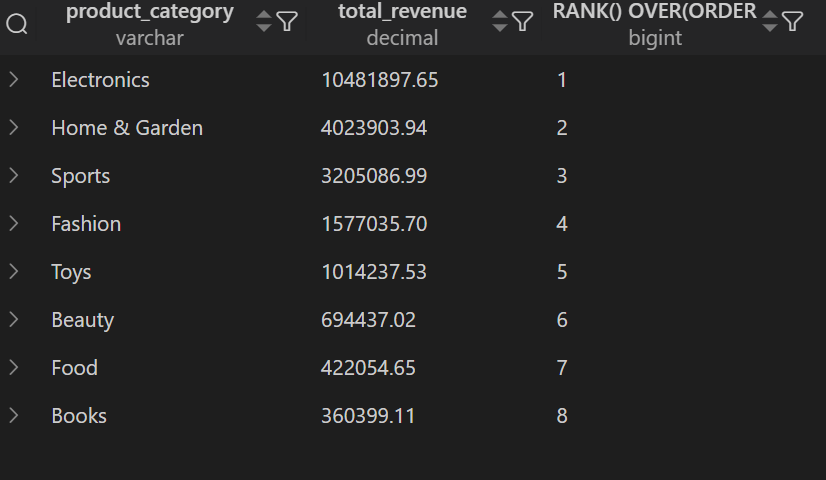


The leading sales categories are:

1. **Electronics**
2. **Home & Garden**
3. **Sports**

Electronics is the dominant category by total sales.

---

## Question 3 — Which cities generate the most sales?

Analysis performed:

- Aggregated revenue by city
- Ranked cities using `RANK()`

Top sales-generating cities:

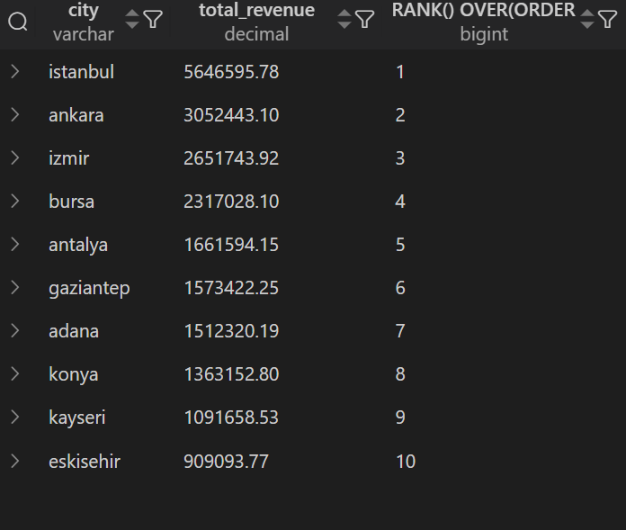

- **Istanbul** — 5,646,595.78
- **Ankara** — 3,052,443.10
- **Izmir** — 2,651,743.92

---

## Question 4 — How does sales performance change month over month?

Analysis performed:

- Extracted year and month from the order date
- Aggregated monthly sales
- Used `LAG()` to retrieve the previous month's sales
- Calculated MoM percentage change

Key observations:

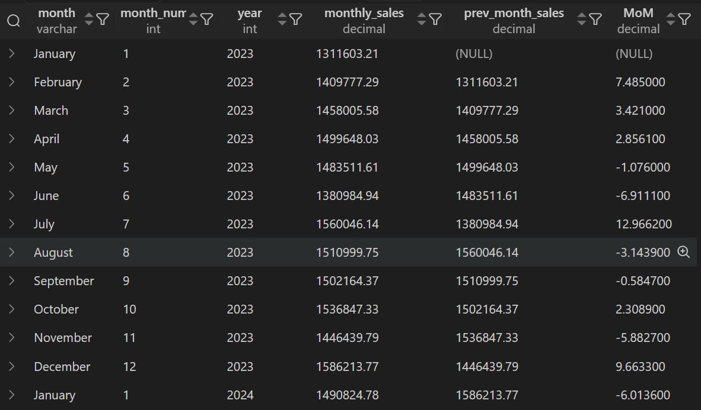

- Strongest MoM sales increase: **July 2023 (+12.97%)**
- Another strong increase: **December 2023 (+9.66%)**
- Largest MoM decline: **February 2024 (-10.80%)**
- Highest monthly sales: **December 2023 (1,586,213.77)**

---

## Question 5 — How does order volume change over time?

Analysis performed:

- Calculated monthly order counts
- Applied `LAG()` to obtain previous-month order volume
- Calculated monthly percentage change

Key observations:

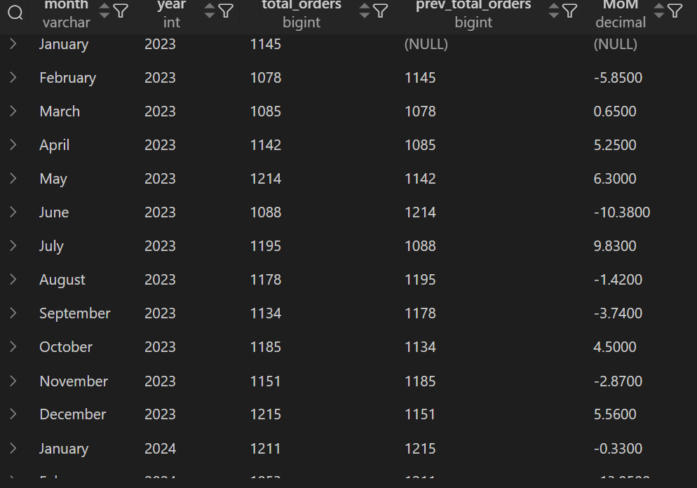

- Order volume dropped sharply from **May to June 2023**
- Strong recovery occurred from **June to July 2023**
- Order volume declined again from **January to February 2024**
- Order volume increased from **November to December 2023**

---

## Question 6 — Do returning customers generate more value?

Analysis performed:

Returning and non-returning customers were compared across:

- Total sales
- Number of orders
- Average Order Value
- Average quantity per order

Key results:

| Metric | Returning | Non-returning |
|---|---:|---:|
| Orders | 15,039 | 2,010 |
| Sales | 19,190,720.46 | 2,588,332.13 |
| AOV | 1,276.06 | 1,287.73 |
| Avg. Quantity / Order | 3.01 | 3.03 |

Interpretation:

> Returning customers generate substantially more total revenue because they account for far more orders. However, their average order value is slightly lower than that of non-returning customers.

This distinction avoids confusing **total revenue** with **revenue per order/customer**.

---

## Question 7 — Who are the highest-value customers?

Analysis performed:

- Aggregated sales and order count by customer
- Ranked customers using `RANK()`
- Identified the top 10 customers by total sales

Top customer by sales:

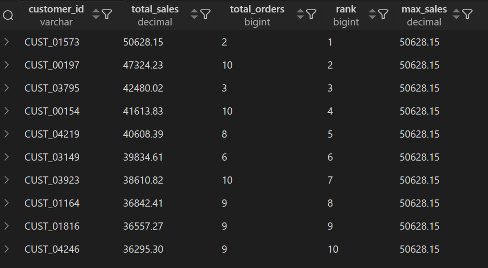

- **CUST_01573** — 50,628.15
- **CUST_00197** — 47,324.23
- **CUST_03795** — 42,480.02
- **CUST_00154** — 41,613.83
- **CUST_04219** — 40,608.39

The analysis also keeps order frequency alongside sales so that high spend is not interpreted without considering purchase behavior.

---

## Question 8 — How frequently do customers purchase, and how does sales contribution differ by frequency group?

Customers were grouped based on total order frequency:

- **Low frequency:** fewer than 4 orders
- **Moderate frequency:** 4–6 orders
- **High frequency:** 7+ orders

Results:

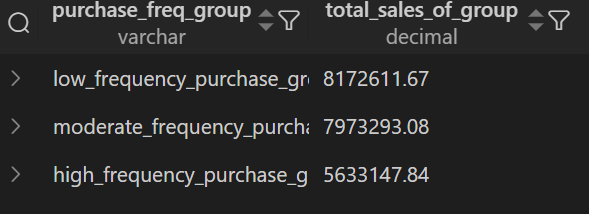

Key finding:

> The low-frequency group contributes the most total revenue because it contains the largest number of customers. However, average revenue per customer rises sharply with purchase frequency.

This demonstrates why **total group revenue alone can be misleading** when groups contain very different numbers of customers.

---

## Question 9 — Which categories rely most heavily on discounts?

Instead of comparing only the absolute discount amount, the analysis calculates a comparable **discount rate**:

```text
Discount Rate = Discount Amount / (Unit Price × Quantity) × 100
```

Discount intensity across categories is relatively similar:

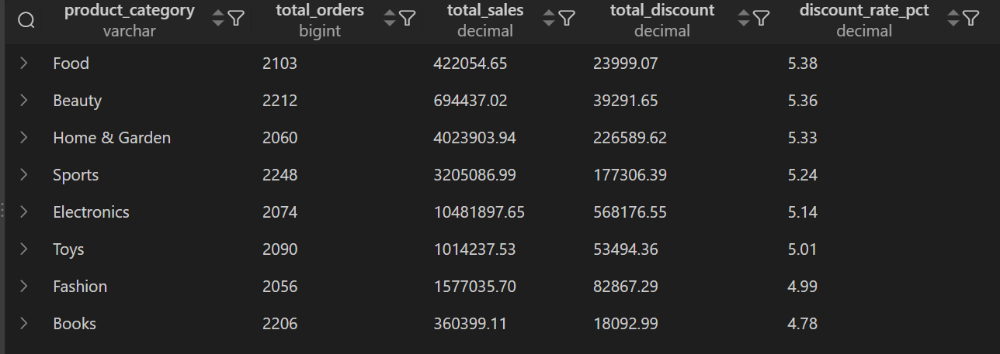

- Highest: **Food (~5.38%)**
- Beauty: **~5.36%**
- Home & Garden: **~5.33%**
- Sports: **~5.24%**
- Electronics: **~5.14%**
- Toys: **~5.01%**
- Fashion: **~4.99%**
- Lowest: **Books (~4.78%)**

Key finding:

> Discount intensity is fairly similar across categories; the largest differences are relatively small rather than showing an extreme discount-dependent category.

---

## Question 10 — Which categories have high sales but relatively low quantity, and vice versa?

Analysis performed:

- Total sales by category
- Total quantity by category
- Sales per unit
- Sales ranking
- Quantity ranking

Key results:

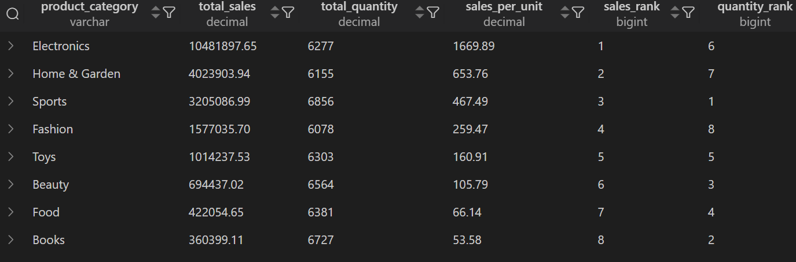

Key finding:

> Electronics and Home & Garden generate high sales despite relatively low quantities because of their high revenue per unit. Sports has the highest quantity but ranks third in sales, while Books has high quantity but the lowest revenue per unit.

---

## Question 11 — Does delivery time relate to customer ratings?

Delivery speed was grouped into four bands:

- Fast delivery: < 6 days
- Late delivery: 6–11 days
- Very late delivery: 12–19 days
- Extremely late delivery: 20+ days

Average ratings:

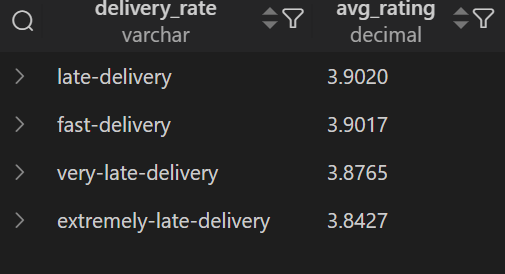

Key finding:

> Customer ratings tend to decline as delivery time increases, particularly for very late and extremely late deliveries.

This is treated as an **association**, not a causal claim.

---

## Question 12 — How does delivery performance compare across the highest-sales cities?

Analysis performed:

- Average delivery time by city
- Average customer rating by city
- Total sales by city

Key observation:

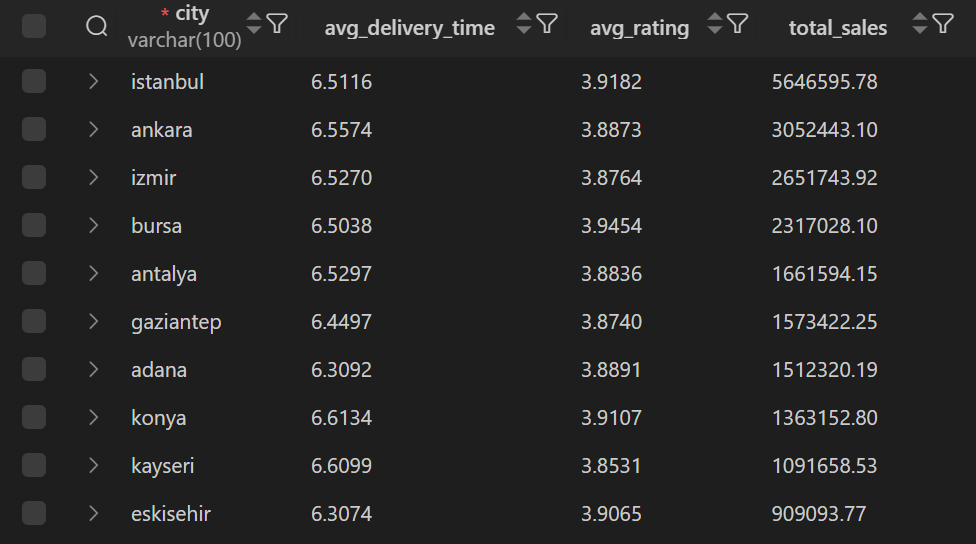

> Istanbul and Ankara generate the highest sales, while Ankara has slightly slower-than-average delivery performance.

Overall average delivery time is approximately **6.50 days**; Ankara is approximately **6.56 days**.

---

## Question 13 — Does longer session duration correspond to higher-value purchases?

Session duration was grouped into:

- Very low: < 7 minutes
- Low: 7–13 minutes
- High: 14+ minutes

Results:

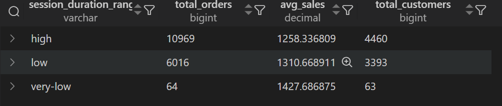

Key finding:

> There is no clear positive relationship between session duration and AOV based on these bands. The very-low group also contains only 64 orders, so its higher AOV should be interpreted cautiously.

---

# 4. SQL Concepts Demonstrated

The project demonstrates practical use of the following SQL concepts:

### Data Definition & Loading

- `CREATE DATABASE`
- `CREATE TABLE`
- `LOAD DATA LOCAL INFILE`
- `ALTER TABLE`
- `MODIFY`
- Primary keys
- Indexes

### Data Validation & Cleaning

- `COUNT()`
- `COUNT(DISTINCT ...)`
- `DISTINCT`
- `REGEXP`
- `TRIM()`
- `STR_TO_DATE()`
- Data-type conversion
- Constraint creation

### Analytical SQL

- `SELECT`
- `WHERE`
- `GROUP BY`
- `ORDER BY`
- Aggregations
- `SUM()`
- `AVG()`
- `COUNT()`
- `MIN()` / `MAX()`
- `CASE`
- CTEs (`WITH`)
- Window functions
- `RANK()`
- `LAG()`
- Date functions such as `YEAR()`, `MONTH()` and `MONTHNAME()`
- Percentage calculations
- Conditional analytical grouping

---


# 5. Project Structure

```text
E-Commerce-Customer-Behavior-Analytics/
│
├── data/
│   └── ecommerce_customer_behavior_dataset_v2.csv
│
├── sql/
│   ├── create_and_load.sql
│   ├── data_clean.sql
│   └── data_analysis.sql
│
│
└── README.md
```

---

# 6. How to Reproduce the Project

## Step 1 — Create the database and load the raw CSV

Run:

```sql
CREATE DATABASE ecommerce;
USE ecommerce;
```

Then create the raw `customer_behavior` table and load the CSV using the commands provided in `create_and_load.sql`.

## Step 2 — Clean and validate the data

Run the queries in:

```text
sql/data_clean.sql
```

This converts the raw string-based fields into appropriate SQL data types, standardizes categorical values, applies constraints, validates business rules, and creates the customer index.

## Step 3 — Run the business analysis

Run:

```text
sql/data_analysis.sql
```

This contains the 13 business-analysis sections and their SQL implementations.


# 7. Key Takeaways

The project produced several major business observations:

1. **Electronics is the largest sales-generating category**, followed by Home & Garden and Sports.
2. **Istanbul is the largest sales-generating city**, followed by Ankara and Izmir.
3. **July 2023 recorded the strongest MoM sales growth**, while February 2024 recorded the largest monthly decline.
4. **Returning customers generate the majority of total revenue**, mainly because they account for far more orders; their AOV is slightly lower than non-returning customers.
5. **Average revenue per customer rises sharply with purchase frequency**, even though the low-frequency segment contributes the most total revenue because it contains the most customers.
6. **Discount intensity is relatively consistent across categories**, with rates clustered around 5%.
7. **Electronics generates exceptionally high revenue per unit**, while categories such as Books and Food require much higher quantities to generate equivalent sales.
8. **Longer delivery times are associated with lower customer ratings**, especially for very late deliveries.
9. **Longer sessions do not show a positive relationship with AOV** in the selected session-duration bands.

---

# 8. Limitations

- The dataset covers **2023-01-01 through 2024-03-25**, so long-term multi-year trend conclusions should be avoided.
- The `Is_Returning_Customer` indicator is treated as a provided field rather than independently reconstructed from transaction history.
- The analysis establishes **descriptive relationships and associations**, not causal effects.
- Some analysis uses manually defined bands, such as delivery-speed and session-duration groups.
- The smallest session-duration group contains only 64 orders and should therefore be interpreted cautiously.
- The dataset represents the provided e-commerce sample and should not be presented as a direct measurement of a real company's current performance unless the original data source explicitly supports that claim.

---

# 9. Conclusion

This project demonstrates an end-to-end workflow for a practical Data Analyst task:

```text
Raw CSV
   ↓
Database Creation & Loading
   ↓
Data Cleaning
   ↓
Data Validation
   ↓
Business Question Formulation
   ↓
SQL Analysis
   ↓
MoM & Behavioral Analysis
   ↓
Business Insights
```

The emphasis of the project is not simply on writing SQL queries, but on using SQL to **translate business questions into measurable analyses, validate the underlying data, interpret results carefully, and communicate the findings visually**.

---


Tools: **MySQL**
